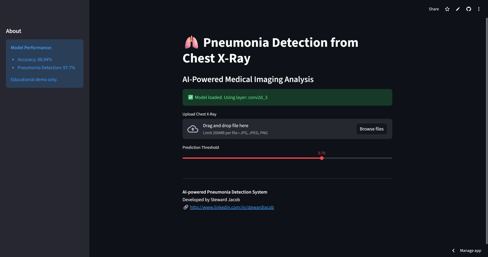

# 🫁 Pneumonia Detection using Deep Learning

An AI-powered web application that detects Pneumonia from Chest X-Ray images using a Convolutional Neural Network (CNN).

Built with:
- TensorFlow / Keras
- Streamlit
- Grad-CAM for explainability

---
## 🚀 Live Demo
🔗 https://pneumonia-detection-stewardjacob.streamlit.app/

## 🖼 Demo


---
## 📌 Problem Statement
Pneumonia is a serious lung infection that requires early diagnosis.  
Manual diagnosis from chest X-rays is time-consuming and requires expert radiologists.

This project aims to:
- Automatically classify chest X-rays as **Normal** or **Pneumonia**
- Provide **visual explanations** of model decisions using Grad-CAM

## Explainability
This app includes **Grad-CAM visualization** to show which lung regions the model focuses on during prediction.

## 🧠 Features
- Upload chest X-ray image
- AI prediction: Normal vs Pneumonia
- Confidence score
- Grad-CAM heatmap (model explainability)
- Clean medical UI
 
---

## 📊 Model
- Input size: 150×150 RGB
- Architecture: Custom CNN
- Accuracy: ~89%
- Pneumonia Recall: ~97%
*(Trained on Kaggle Chest X-Ray dataset)*

---
## 🛠 Tech Stack

### Machine Learning
- Python
- TensorFlow / Keras
- NumPy
- OpenCV

### Web App
- Streamlit
- Pillow (PIL)

### Tools
- Git & GitHub
- VS Code

---
## 📂 Project Structure
pneumonia_project/
│
├── app.py
├── model/
│ └── pneumonia_detection_model.h5
├── notebooks/
│ └── Pneumonia_Detection_Project.ipynb
├── README.md
└── requirements.txt
---

## ▶️ How to Run Locally

```bash
git clone https://github.com/STXWARD/Pneumonia-detection.git
cd Pneumonia-detection
pip install -r requirements.txt
streamlit run app.py

## ⚠️ Disclaimer
This application is for educational and research purposes only.
It is not a medical diagnostic tool and should not be used for real clinical decisions.

---
Future Improvements

-Train on larger and more diverse datasets

-Multi-class classification

-Model calibration

-Doctor-friendly UI
---
## 👨‍💻 Author
**Steward Jacob**  
LinkedIn: https://www.linkedin.com/in/stewardjacob
